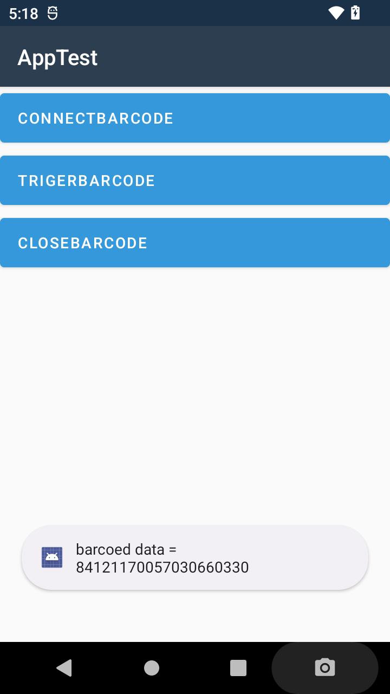
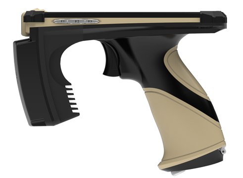

# rodinbell-handhelp-barcode-xamarin
Evaluation rodinbell orca50 handhelp barcode 3396 xamarin

## 1. init a Barcode : 
        BarcodeHelper myBarcodeHelper = new BarcodeHelper();
        myBarcodeHelper.SetBarcodeEvnet(this);

## 2. connect Barcode : 
        var res = myBarcodeHelper.ConnectScanner(this);

## 3. get Barcode info :
        public void OnBarcodeStr(string barcodestr)
        {
            Console.WriteLine("barcoed data == " + barcodestr);
        }

          