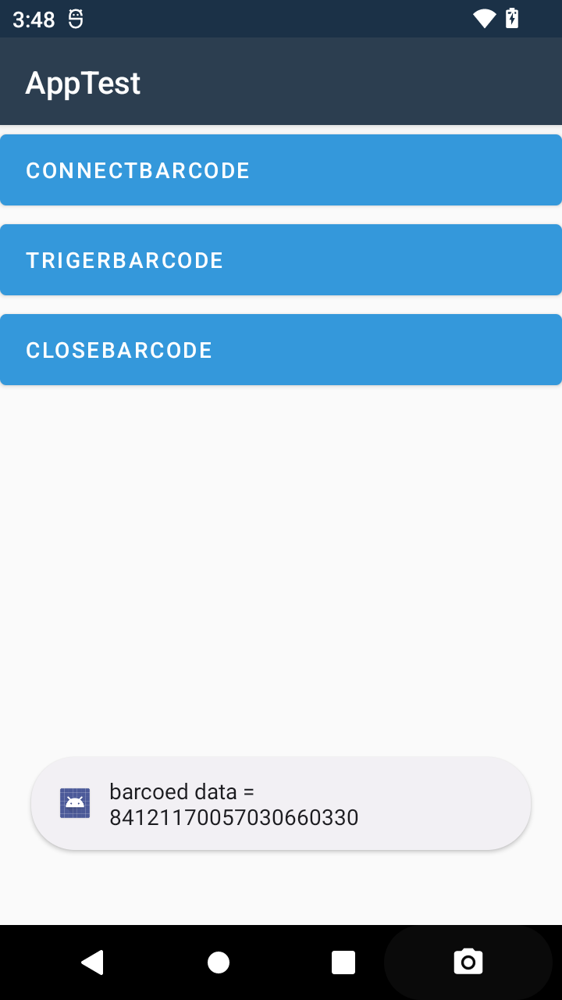
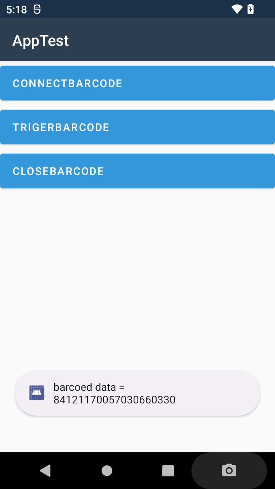

# rodinbell-handhelp-barcode-xamarin
Evaluation rodinbell orca50 handhelp barcode 3396 xamarin
评估项目 罗丹贝尔 orca50 手持机 新大陆3396 条码头 xamarin c# 

## 1. 初始化设备: 
        BarcodeHelper myBarcodeHelper = new BarcodeHelper();
        myBarcodeHelper.SetBarcodeEvnet(this);

## 2. 连接条码: 
        var res = myBarcodeHelper.ConnectScanner(this);

## 3. 扣扳机获取条码信息 :
        public void OnBarcodeStr(string barcodestr)
        {
            Console.WriteLine("barcoed data == " + barcodestr);
        }

          